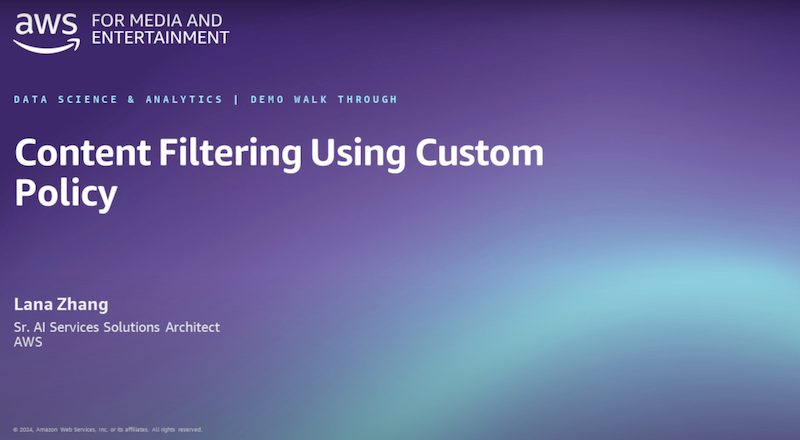
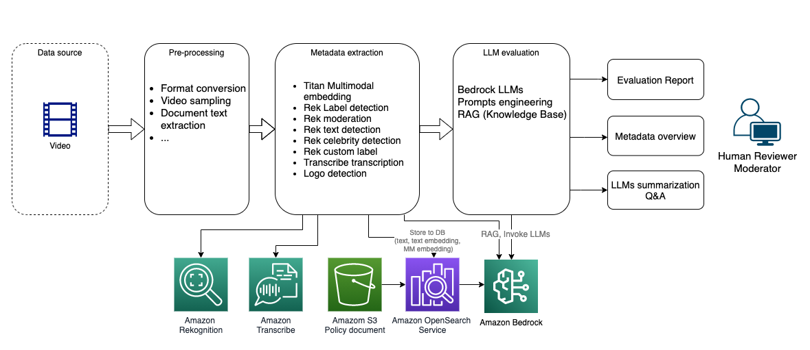
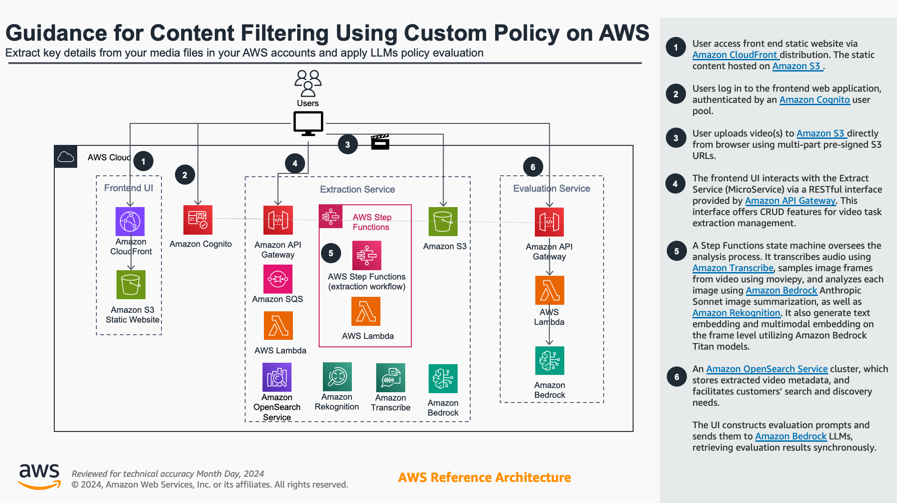
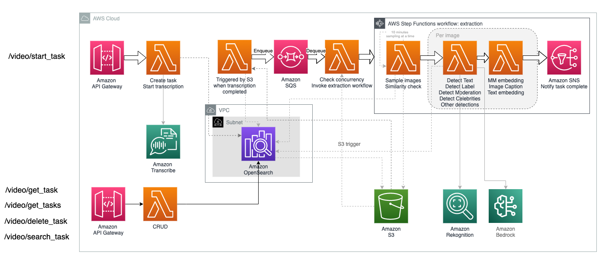

# Media Analysis and Policy Evaluation Framework

Customers in Media & Entertainment, Advertising, Social Media, Education and more industries require an effective solution for extracting metadata from media assets such as video, audio, and images. They also need flexible analysis options, including summarization and policy evaluation. This solution serves as a generic framework allowing users to streamline the extraction and evaluation processes.

This solution is designed for two personas: business users and builders. 
- Business users who seek to utilize a ready-made tool for media asset analysis and policy evaluation can take advantage of the built-in UI. They can upload videos, manage customized policy documents using Bedrock Knowledge Base, and apply flexible policy evaluation. 
- For builders in search of a modular solution for video extraction, user/face mapping, and LLMs analysis, they can deploy the backend micro-service independently and integrate it into their workflow.

This tool can be utilized for comprehensive video content analysis, encompassing but not limited to:
- Content Moderation
- DEI detection
- Customized policy evaluation
- IAB classfication
- Video summarization

The solution is available as a [CDK](https://aws.amazon.com/cdk/) package, which you can deploy to your AWS account by following [these instructions](./deployment-instruction.md).

## Watch the demo video

## Highlighted features
The solution utilized Amazon AI and Generative AI services for video metadata extraction and analysis, providing transparency into both architecture and cost levels. With key features:
- Video search powered by full-text search, semantic embedding search ([Amazon Titan](https://aws.amazon.com/bedrock/titan) text embedding), and image search (Amazon Titan multimodal embedding).
- Video Smart Sampling powered by Amazon Titan multimodal embedding for similarity analysis, effectively reducing redundant frames in samples, therefore optimized the cost.
- Video frame summarization/captioning employing [Amazon Bedrock](https://aws.amazon.com/bedrock) Anthropic Claude 3 (Sonnet/Haiku).
- Integration of LLMs + RAG (Amazon Bedrock LLMs and [Knowledge Bases](https://aws.amazon.com/bedrock/knowledge-bases/)) for dynamic policy evaluation and advanced analysis use cases.
- Utilizing [Amazon Transcribe](https://aws.amazon.com/pm/transcribe) for audio to text transcription.
- Utilizing [Amazon Rekognition](https://aws.amazon.com/rekognition/) Celebrity detection, Label detection, Moderation detection, Text extraction on the image frame level metadata extraction.

In addition to its AI/GenAI capabilities, the solution also functioned as a framework with engineering features driven by AWS serverless architecture:
- The solution includes a Web UI that streamlines video uploading, processing, and analysis.
- A serverless backend workflow effectively handled video processing and sampling with a configurable concurrency with high availability.
- Supports both fixed interval frame sampling and "Smart Sampling," which intelligently ignores similar frames to prevent redundant extraction and analysis.
- Employing a micro-service architecture, backend subsystems can be deployed independently to facilitate system integration.
- The flexible workflow design allows additional analysis at the video frame level. This included the integration of in-house trained or third-party ML models for analysis.

## Architecture
The high-level workflow, as illustrated below, comprises a few major steps. 
- The user uploads media content (currently supporting videos). The application initiates pre-processing, extracting image frames from the video, and applies extraction for each image frame using Amazon Rekognition and Amazon Bedrock. 
- It extracts audio transcription using Amazon Transcribe. 
- It applies LLMs analysis based on the metadata extracted from the video. The LLMs analysis stage is flexible and offers a web UI for users to modify the prompts for better accuracy.

The solution embraces microservice design principles, with frontend and backend services decoupled, allowing each component to be deployed independently as a microservice without dependencies. This architecture enables flexible extension of the solution. For example, adding a new user/face tagging backend service would not impact the policy evaluation service.

## Metadata extraction
Extracting metadata from media assets like video and audio is a common requirement for enabling downstream analysis and search capabilities. This solution includes a core module that supports generic metadata extraction from media assets, encompassing both audio transcription and visual metadata extraction. The visual extraction feature adopts a flexible sampling configuration, allowing users to set the sample frequency, with more advanced sampling logic forthcoming. For each image frame, users can apply flexible extraction logic, such as Rekognition label detection, Rekognition moderation, Rekognition celebrity detection, Rekognition text extraction, Bedrock Titan multimodal embedding, and Bedrock Anthropic Claude V3 Sonnet image captioning, with the capability to extend support to additional video frame-level analysis. Audio transcription leverages Amazon Transcribe, providing full transcription and subtitles.

## Custom policy evaluation

Customers need to evaluate their media assets against internal and external policies, which may include standard policies such as Trust & Safety, DEI, and industry-specific or company-specific policies. This solution introduces a flexible approach to managing policy evaluation using Bedrock LLMs. You can manage policy definitions via prompts engineering or by utilizing Bedrock Knowledge Base, a managed RAG (Retrieval Augmented Generation) solution. The demo UI includes a sandbox feature that allows users to flexibly adjust the metadata used for evaluation and review the evaluation results from LLMs.

## Deployment instruction
Follow this instruction to deploy the solution to your AWS account using CDK.

[Deploy all components, including the web portal](./deployment-instruction.md)
