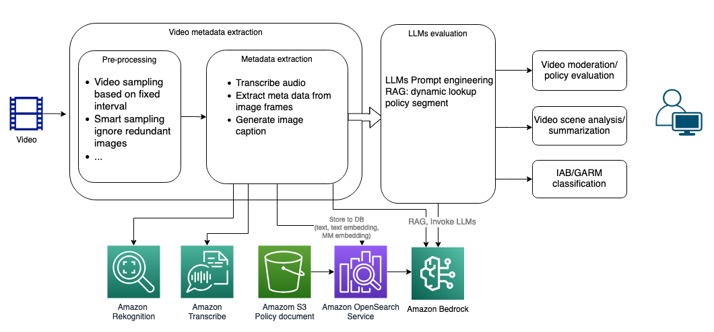

# Guidance for Media Extraction and Dynamic Content Policy Evaluation Framework on AWS

## Table of Content

1. [Overview](#overview)
    - [Architecture Overview](#architecture-overview)
    - [Highlighted features](#highlighted-features)
    - [Cost](#cost)
2. [Prerequisites](#prerequisites)
    - [Install environment dependencies and set up authentication](#install-environment-dependencies-and-set-up-authentication)
    - [Service limits](#service-limits)
    - [Supported Regions](#supported-regions)
3. [Deployment Steps](#deployment-steps)
4. [Deployment Validation](#deployment-validation)
5. [Running the Guidance](#running-the-guidance)
6. [Cleanup](#cleanup)
7. [Known Issues](#known-issues)
8. [Notices](#notices)
9. [Authors](#authors)

## Overview

Organizations across media and entertainment, advertising, social media, education, and other sectors require efficient solutions to extract information from videos and apply flexible evaluations based on their policies. Generative artificial intelligence (AI) has unlocked fresh opportunities for these use cases. This solution uses AWS AI and generative AI services to provide a framework to streamline video extraction and evaluation processes.

### Architecture Overview

The high-level workflow, as illustrated below, comprises a few major steps. 
- The user uploads media content (currently supporting videos). The application initiates pre-processing, extracting image frames from the video, and applies extraction for each image frame using Amazon Rekognition and Amazon Bedrock. 
- It extracts audio transcription using Amazon Transcribe. 
- It applies LLMs analysis based on the metadata extracted from the video. The LLMs analysis stage is flexible and offers a web UI for users to modify the prompts for better accuracy.


The solution embraces microservice design principles, with frontend and backend services decoupled, allowing each component to be deployed independently as a microservice without dependencies. This architecture enables flexible extension of the solution. For example, adding a new user/face tagging backend service would not impact the policy evaluation service.


### Highlighted features
The solution utilized Amazon AI and Generative AI services for video metadata extraction and analysis, providing transparency into both architecture and cost levels. With key features:
- Video search powered by full-text search, semantic embedding search ([Amazon Titan](https://aws.amazon.com/bedrock/titan) text embedding), and image search (Amazon Titan multimodal embedding).
- Video Smart Sampling powered by Amazon Titan multimodal embedding for similarity analysis, effectively reducing redundant frames in samples, therefore optimized the cost.
- Video frame summarization/captioning employing [Amazon Bedrock](https://aws.amazon.com/bedrock) Anthropic Claude 3 (Sonnet/Haiku).
- Integration of LLMs + RAG (Amazon Bedrock LLMs and [Knowledge Bases](https://aws.amazon.com/bedrock/knowledge-bases/)) for dynamic policy evaluation and advanced analysis use cases.
- Utilizing [Amazon Transcribe](https://aws.amazon.com/pm/transcribe) for audio to text transcription.
- Utilizing [Amazon Rekognition](https://aws.amazon.com/rekognition/) Celebrity detection, Label detection, Moderation detection, Text extraction on the image frame level metadata extraction.

In addition to its AI/GenAI capabilities, the solution also functioned as a framework with engineering features driven by AWS serverless architecture:
- The solution includes a Web UI that streamlines video uploading, processing, and analysis.
- A serverless backend workflow effectively handled video processing and sampling with a configurable concurrency with high availability.
- Supports both fixed interval frame sampling and "Smart Sampling," which intelligently ignores similar frames to prevent redundant extraction and analysis.
- Employing a micro-service architecture, backend subsystems can be deployed independently to facilitate system integration.
- The flexible workflow design allows additional analysis at the video frame level. This included the integration of in-house trained or third-party ML models for analysis.


### Cost

You are responsible for the cost of the AWS services used while running this Guidance. There are several factors can impact the monthly cost. 
- Amazon OpenSearch Service (OpenSearch) cluster settings: OpenSearch will incur a monthly cost. Choosing the 'Dev' option will deploy a cluster with a single data node. For production workloads, you can choose the 'Prod' setting to support a larger volume of searches.
- Enabling smart sampling: The solution utilizes Amazon Titan Multimodal embedding to deduplicate image frames sampled from the video. Enabling smart sampling typically reduces the number of sampled frames, thereby lowering extraction costs.
- Choose the AI/GenAI features for frame metadata extraction: Selecting fewer AI features (Amazon Rekognition and Amazon Bedrock Anthropic Claude V3 Haiku) in the video extraction configuration will reduce costs.
- Enabling audio transcription: The solution uses Amazon Transcribe to convert the audio of the video into text. You can disable audio transcription for videos that don't require audio extraction to reduce costs.

Below are a few sample cost estimations in USD for extracting 1,000 minutes of video per month in the us-east-1 region:
- **~$350**: OpenSearch (Dev), enabled smart sampling (50% sample rate), enabled all the visual extraction features, enabled audio transcription.
- **~$280**: OpenSearch (Dev), enabled smart sampling (50% sample rate), enabled visual extraction features: Label detection, moderation detection, text extraction, image caption, disabled audio transcription.

For production workloads, you can reach out to your AWS account team for a more detailed cost estimation.

## Prerequisites

- If you don't have the AWS account administrator access, ensure your [IAM](https://aws.amazon.com/iam/) role/user has permissions to create and manage the necessary resources and components for this solution.
- Please check the numbers of VPCs already launched in the account region where you plan to deploy the solution. The default quota for VPCs per region in the us-east-1 is 5. If the VPCs limit has already been reached in the region, you will need to increase the quota limit (+1) before deployment. You can manage the quota increase yourself using the AWS console by navigating to the ["Service Quotas" page](https://us-east-1.console.aws.amazon.com/servicequotas/home?region=us-east-1).
- In Amazon Bedrock, make sure you have access to the required models. Refer to [this instruction](https://catalog.workshops.aws/building-with-amazon-bedrock/en-US/prerequisites/bedrock-setup) for detail.

### Install environment dependencies and set up authentication

<details><summary>
:bulb: Skip if using CloudShell or AWS services that support bash commands from the same account (e.g., Cloud9). Required for self-managed environments like local desktops.
</summary>

- [ ] Install Node.js
https://nodejs.org/en/download/

- [ ] Install Python 3.8+
https://www.python.org/downloads/

- [ ] Install Git
https://github.com/git-guides/install-git

- [ ] Install Pip
```sh
python -m ensurepip --upgrade
```

- [ ] Install Python Virtual Environment
```sh
pip install virtualenv
```


- [ ] Setup the AWS CLI authentication
```sh
aws configure                                                                     
 ```                      
</details>


If your CloudShell instance has older dependency libraries like npm or pip, it may cause deployment errors. To resolve this, click 'Actions' and choose 'Delete AWS CloudShell Home Directory' to start a fresh instance.

### Service limits
The solution processes videos and extracts video frames concurrently. The number of videos and frames that can be processed in parallel depends on the related AI services quota in the deployed region. Some quotas can be increased upon request. Ensure that the following service quotas meet the requirements before increasing the extraction concurrency settings.
Amazon Rekognition, Amazon Bedrock, Amazon Transcribe

### Supported Regions
The solution requires AWS AI and Generative AI services, including Amazon Bedrock, Amazon Rekognition and Amazon Transcribe, which are available in certain regions. Please choose one of the below AWS regions to deploy the CDK package.

|||||
---------- | ---------- | ---------- | ---------- |
US | us-east-1 (N. Virginia) | us-west-2 (Oregon) ||

The solution requires access to Amazon Bedrock Foundation Models (FMs): Titan multimodal embedding, Titan text embedding, Anthropic Claude V3 models. If you are deploying the solution stack in other regions, such as Europe (Ireland), you can still try out the Amazon Bedrock FM models by choosing the model access in one of these regions: us-east-1, us-west-2 in the source/cdk.json file. Keep in mind that there will be additional Data Transfer cost across regions.

## Deployment Steps
1. Clone the source code from GitHub repo 

```
git clone git@github.com:aws-solutions-library-samples/guidance-for-media-extraction-and-dynamic-content-policy-evaluation-framework-on-aws.git
cd guidance-for-media-extraction-and-dynamic-content-policy-evaluation-framework-on-aws
```

2. Set up environment varaibles 

Set environment variables as input parameters for the CDK deployment package:

CDK_INPUT_USER_EMAILS: Email address(es) for login to the web portal. They will receive temporary passwords.
```
export CDK_INPUT_USER_EMAILS=<EMAILS_SPLIT_BY_COMMA>
```
Update the values with your target AWS account ID and the region where you intend to deploy the demo application.
```
export CDK_DEFAULT_ACCOUNT=<YOUR_ACCOUNT_ID>
export CDK_DEFAULT_REGION=<YOUR_TARGET_REGION> (e.x, us-east-1)
```
CDK_INPUT_OPENSEARCH_CONFIG: Configure the size of the Amazon OpenSearch cluster, accepting either "Dev" or "Prod" as values with a default value set to "Dev".
- Dev: suitable for development or testing environment. (No master node, 1 data node: m4.large.search)
- Prod: suitable for handling large volumes of video data. (3 master nodes: m4.large.search, 2 data nodes: m5.xlarge.search)
```
export CDK_INPUT_OPENSEARCH_CONFIG=<OPENSEARCH_CONFIG> ("Dev" or "Prod")
```

3. Run **deploy-cloudshell.sh** in CloudShell to deploy the application to your AWS account with the parameters defined in step 2.
```
cd deployment
bash ./deploy-cloudshell.sh
```

## Deployment Validation

Once the deployment completes, you can find the website URL in the bash console. You can also find it in the CloudFormation console by checking the output in stack **VideoAnalysisRootStack**.


## Running the Guidance
An email with a username and temporary password will be sent to the email(s) you provided in deployment steps. Users can use this information to log in to the web portal.

## Cleanup

When you’re finished experimenting with this solution, clean up your resources by running the command from CloudShell:

```
cdk destroy
```

These commands deletes resources deploying through the solution. 
You can also go to the CloudFormation console, select the VideoAnalysisRootStack stack, and click the Delete button to remove all the resources.

## Known issues
For deployments in regions other than us-east-1, the web UI may not function properly for video uploads. This issue should resolve itself within an hour.

## Notices

*Customers are responsible for making their own independent assessment of the information in this Guidance. This Guidance: (a) is for informational purposes only, (b) represents AWS current product offerings and practices, which are subject to change without notice, and (c) does not create any commitments or assurances from AWS and its affiliates, suppliers or licensors. AWS products or services are provided “as is” without warranties, representations, or conditions of any kind, whether express or implied. AWS responsibilities and liabilities to its customers are controlled by AWS agreements, and this Guidance is not part of, nor does it modify, any agreement between AWS and its customers.*

## Authors

Lana Zhang (lanaz@amazon.com)
