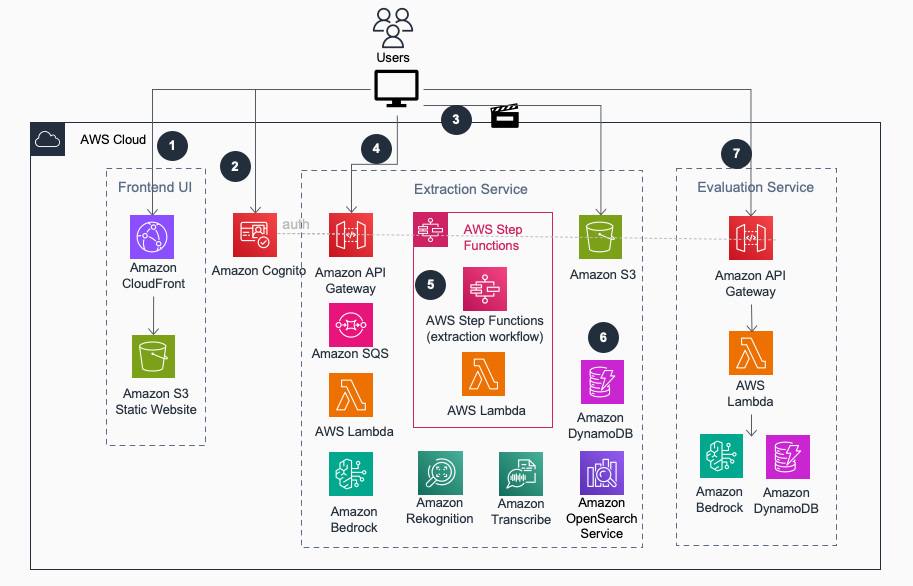
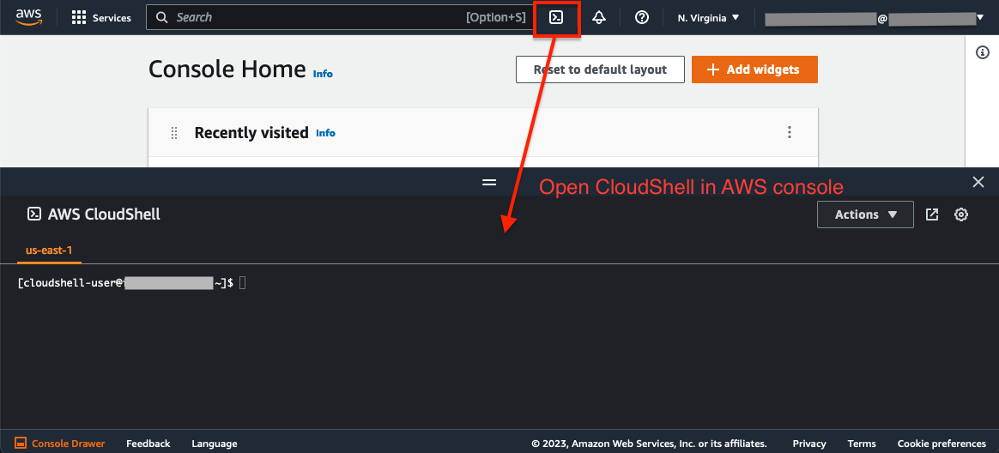

# Media Analysis and Policy Evaluation Framework

## Table of Content

1. [Overview](#overview)
    - [Architecture Overview](#architecture-overview)
    - [Highlighted features](#highlighted-features)
    - [Cost](#cost)
2. [Prerequisites](#prerequisites)
    - [Install environment dependencies and set up authentication](#install-environment-dependencies-and-set-up-authentication)
    - [Service limits](#service-limits)
    - [Supported Regions](#supported-regions)
3. [Deployment Steps](#deployment-steps)
4. [Deployment Validation](#deployment-validation)
5. [Running the Guidance](#running-the-guidance)
6. [Cleanup](#cleanup)
7. [Known Issues](#known-issues)
8. [Notices](#notices)
9. [Authors](#authors)

## Overview

Organizations across advertising, media and entertainment, social media, education, gaming, and other sectors require efficient solutions to evaluate and analyze video assets flexibly. Generative AI (GenAI) has unlocked new opportunities and significantly enhanced the accuracy and flexibility of these workflows.

While building a GenAI-powered video analysis workflow is accessible, customers with video assets often create redundant pipelines that lead to repeated metadata extraction, and higher costs. This solution offers robust components that enable builders to reuse extraction results across multiple analysis pipelines, thereby reducing unnecessary effort and lowering costs. It achieves this by breaking the video analysis process into two independent steps:

1. Extract Information: A generic process that utilize AI, ML, and GenAI features to detect and extract information from both the visual and audio aspects of the video at the desired level of granularity. 

2. Analyze the Data: With detailed video metadata, a variety of business needs can be addressed. This solution features a built-in UI LLM sandbox, enabling users to quickly test popular video analysis use cases using their own videos, including but not limited to:

    - Content moderation.
    - Customized policy evaluation, including DEI, grooming, and other tailored business rules. 
    - IAB/GARM classification.
    - Video summarization.
    - Video scene analysis and ad break detection.
    - More adhoc video analysis use cases.

The solution is available as a [CDK](https://aws.amazon.com/cdk/) package, which you can deploy to your AWS account by following the [instruction](#install-environment-dependencies-and-set-up-authentication).

#### Logical workflow


### Architecture Overview

The solution employs a microservices serverless architecture, which consists of three loosely coupled components:

- **Web UI**: This allows users to upload videos, extract metadata, and apply dynamic analysis in a self-serve manner. It is a static React application hosted on [Amazon S3](https://aws.amazon.com/s3/) as a static website, with [Amazon CloudFront](https://aws.amazon.com/cloudfront/) for content distribution, [Amazon Cognito](https://aws.amazon.com/cognito/) user pool, and [Amazon Amplify](https://aws.amazon.com/amplify/) for authentication.
- **Extraction Service**: This core component manages the video metadata extraction workflow, orchestrating visual extraction from sampled video frames, applying AI features for data extraction, and transcribing audio to text. It supports process concurrency, ensures high availability, and provides flexible configuration options. The extracted data is accessible via S3 and RESTful APIs. It is built using [Amazon Step Functions](https://aws.amazon.com/step-functions/), [Amazon API Gateway](https://aws.amazon.com/api-gateway/), [AWS Lambda](https://aws.amazon.com/lambda/), [Amazon DynamoDB](https://aws.amazon.com/dynamodb/), [Amazon OpenSearch Service](https://aws.amazon.com/opensearch-service/), [Amazon SQS](https://aws.amazon.com/sqs/), [Amazon SNS](https://aws.amazon.com/sns/), Amazon S3, and [Amazon VPC](https://aws.amazon.com/vpc/).
- **Evaluation Service**: A lightweight component that enables users to create GenAI prompts and run evaluation tasks via a Web UI, with sample templates for video moderation, summarization, and IAB classification, demonstrating flexible video analysis based on Extraction Service output. This is a serverless application utilizing Amazon API Gateway, AWS Lambda, [Amazon Bedrock](https://aws.amazon.com/bedrock/), and Amazon DynamoDB.



### Highlighted features
The main component of the solution enables users to extract video metadata from both visual and audio sources to support downstream dynamic analysis needs. The extracted video data will be accessible through the built-in UI for review, and it can also be accessed programmatically for system integration in the following two ways:
- Via S3 as raw extraction files (in JSON and text file formats).
- Via RESTful APIs.

The extraction service allows you to customize the extraction process, including:
- Sample frequency (numbers of frames per second)
- Whether to enable Smart Sampling (remove similiar frames)
- Which ML features are applied at the frame level extraction (label, text, celebrity, moderation and image summary)
- Whether to enable audio transcription
- Whether to perform shot analysis with summarization

This flexibility gives users control over the workflow, enabling only the necessary features to optimize costs and processing times. Below is a screenshot of the extraction configuration page. The same settings can also be configured via the RESTful API.


#### Extracted Video Data
The extraction service will output video data at the following levels of granularity:
- **Visual Frames**

    Image frames are sampled from the video based on the provided sampling interval, with "smart sampling" enabled to remove adjacent similar image frames utilizing Amazon Bedrock [Titan](https://aws.amazon.com/bedrock/titan) Multimodal Embedding and Vector DB similarity search, optimizing costs and reducing processing time. The following metadata is generated at the frame level:
    - Timestamp: The exact time the frame was captured from the video.
    - Labels: Generic labels detected using [Amazon Rekognition](https://aws.amazon.com/rekognition/)’s [DetectLabels API](https://docs.aws.amazon.com/rekognition/latest/dg/labels-detect-labels-image.html).
    - Text: Text in video frame extracted using Amazon Rekognition’s [DetectText API](https://docs.aws.amazon.com/rekognition/latest/dg/text-detection.html).
    - Celebrity: Well known faces detected using Amazon Rekognition’s [DetectCelebrities API](https://docs.aws.amazon.com/rekognition/latest/dg/celebrities.html).
    - Content moderation labels: Unsafe and inappropriate content classified using Amazon Rekognition’s [DetectModerationLabels API](https://docs.aws.amazon.com/rekognition/latest/dg/moderation.html).
    - Image summary: Generic description of the image, generated using the Amazon Bedrock [Anthropic Claude](https://aws.amazon.com/bedrock/claude) V3 Haiku model.
    - Text embedding and multimodal embedding: Vectors generated using [Amazon Bedrock Titan](https://aws.amazon.com/bedrock/titan) multimodal and text embedding models to support semantic search and image search.

- **Visual Shots**

    A continuous sequence of frames captured by a single camera without interruption. The solution utilizes the similarity score generated at the frame level to identify shots. The following metadata is available for video shots:
    - Shot start and end timestamps: The exact time range of the shot.
    - Shot summary: A summary of the shot, generated based on the frame summaries and audio transcription using the Amazon Bedrock Anthropic Claude V3 Haiku model.

- **Audio Transcripts**
    - Transcript start and end timestamps: The time range of each subtitle segment.
    - Audio transcrip: Generated using [Amazon Transcribe](https://aws.amazon.com/pm/transcribe).

### Customize the Extraction Service
The Extraction Service is designed for easy extension and integration with in-house trained or third-party ML models. For instance, as illustrated in the implementation diagram below, users can make minor modifications to the Lambda functions within the frame iteration subflow to incorporate additional ML models, resulting in richer extraction outcomes.


### Cost

You are responsible for the cost of the AWS services used while running this Guidance. There are several factors can impact the monthly cost. 
- Amazon OpenSearch Service (OpenSearch) cluster settings: OpenSearch will incur a monthly cost. Choosing the 'Dev' option will deploy a cluster with a single data node. For production workloads, you can choose the 'Prod' setting to support a larger volume of searches.
- Enabling smart sampling: The solution utilizes Amazon Titan Multimodal embedding to deduplicate image frames sampled from the video. Enabling smart sampling typically reduces the number of sampled frames, thereby lowering extraction costs.
- Choose the AI/GenAI features for frame metadata extraction: Selecting fewer AI features (Amazon Rekognition and Amazon Bedrock Anthropic Claude V3 Haiku) in the video extraction configuration will reduce costs.
- Enabling audio transcription: The solution uses Amazon Transcribe to convert the audio of the video into text. You can disable audio transcription for videos that don't require audio extraction to reduce costs.

Here are sample cost estimates for a monthly volume of 1,000 video minutes:
- **~$350** (¢35 per min): OpenSearch (Dev), 1 FPS (Frame Per Second) sample rate, enabled smart sampling (50% sample rate), enabled all the visual extraction features, enabled audio transcription.
- **~$280** (¢28 per min): OpenSearch (Dev), 1 FPS sample rate,, enabled smart sampling (50% sample rate), enabled visual extraction features: Label detection, moderation detection, text extraction, image caption, disabled audio transcription.
- **~$160** (¢16 per min): without OpenSearch (no vector search supported), 0.2 FPS (every 5 seconds) sample rate, enabled smart sampling (50% sample rate), enabled all the visual extraction features, enabled audio transcription.


For production workloads, please contact your AWS account team for a more detailed cost estimation. Increased usage may qualify for private pricing options, which can further reduce your costs.

## Prerequisites

- If you don't have the AWS account administrator access, ensure your [IAM](https://aws.amazon.com/iam/) role/user has permissions to create and manage the necessary resources and components for this solution.
- Please check the numbers of VPCs already launched in the account region where you plan to deploy the solution. The default quota for VPCs per region in the us-east-1 is 5. If the VPCs limit has already been reached in the region, you will need to increase the quota limit (+1) before deployment. You can manage the quota increase yourself using the AWS console by navigating to the ["Service Quotas" page](https://us-east-1.console.aws.amazon.com/servicequotas/home?region=us-east-1).
- In Amazon Bedrock, make sure you have access to the required models: 
    - Titan multimodal embedding V1
    - Titan text embedding V2
    - Anthropic Claude V2 
    - Anthropic Claude V3 Haiku 
    - Anthropic Claude V3/V3.5 Sonnet

    Refer to [this guide](https://catalog.workshops.aws/building-with-amazon-bedrock/en-US/prerequisites/bedrock-setup) for instructions on managing access to Bedrock models.

### Install environment dependencies and set up authentication

<details><summary>
:bulb: Skip if using CloudShell or AWS services that support bash commands from the same account (e.g., Cloud9). Required for self-managed environments like local desktops.
</summary>

- [ ] Install Node.js
https://nodejs.org/en/download/

- [ ] Install Python 3.9+
https://www.python.org/downloads/

- [ ] Install Git
https://github.com/git-guides/install-git

- [ ] Install Pip
```sh
python -m ensurepip --upgrade
```

- [ ] Install Python Virtual Environment
```sh
pip install virtualenv
```


- [ ] Setup the AWS CLI authentication
```sh
aws configure                                                                     
 ```                      
</details>



If your CloudShell instance has older dependency libraries like npm or pip, it may cause deployment errors. To resolve this, click 'Actions' and choose 'Delete AWS CloudShell Home Directory' to start a fresh instance.

### Service limits
The solution processes videos and extracts video frames concurrently. The number of videos and frames that can be processed in parallel depends on the related AI services quota in the deployed region. Some quotas can be increased upon request. Ensure that the following service quotas meet the requirements before increasing the extraction concurrency settings.
Amazon Rekognition, Amazon Bedrock, Amazon Transcribe

### Supported Regions
The solution requires AWS AI and Generative AI services, including Amazon Bedrock, Amazon Rekognition and Amazon Transcribe, which are available in certain regions. Please choose one of the below AWS regions to deploy the CDK package.

|||||
---------- | ---------- | ---------- | ---------- |
US | us-east-1 (N. Virginia) | us-west-2 (Oregon) ||

The solution requires access to Amazon Bedrock Foundation Models (FMs): Titan multimodal embedding, Titan text embedding, Anthropic Claude V3 models. If you are deploying the solution stack in other regions, such as Europe (Ireland), you can still try out the Amazon Bedrock FM models by choosing the model access in one of these regions: us-east-1, us-west-2 in the source/cdk.json file. Keep in mind that there will be additional Data Transfer cost across regions.

## Deployment Steps
1. Clone the source code from GitHub repo 

```
git clone https://github.com/aws-samples/media-analysis-policy-evaluation-framework.git
cd media-analysis-policy-evaluation-framework
```

2. Set up environment varaibles 

Set environment variables as input parameters for the CDK deployment package:

CDK_INPUT_USER_EMAILS: Email address(es) for login to the web portal. They will receive temporary passwords.
```
export CDK_INPUT_USER_EMAILS=<EMAILS_SPLIT_BY_COMMA>
```
Update the values with your target AWS account ID and the region where you intend to deploy the demo application.
```
export CDK_DEFAULT_ACCOUNT=<YOUR_ACCOUNT_ID>
export CDK_DEFAULT_REGION=<YOUR_TARGET_REGION> (e.x, us-east-1)
```
CDK_INPUT_OPENSEARCH_CONFIG: Configure the size of the Amazon OpenSearch cluster, accepting either "Dev" or "Prod" as values with a default value set to "Dev".
- Dev: suitable for development or testing environment. (No master node, 1 data node: m4.large.search)
- Prod: suitable for handling large volumes of video data. (3 master nodes: m4.large.search, 2 data nodes: m5.xlarge.search)
```
export CDK_INPUT_OPENSEARCH_CONFIG=<OPENSEARCH_CONFIG> ("Dev" or "Prod")
```

3. Run **deploy-cloudshell.sh** in CloudShell to deploy the application to your AWS account with the parameters defined in step 2.
```
cd deployment
bash ./deploy-cloudshell.sh
```

## Deployment Validation

Once the deployment completes, you can find the website URL in the bash console. You can also find it in the CloudFormation console by checking the output in stack **VideoAnalysisRootStack**.


## Running the Guidance
An email with a username and temporary password will be sent to the email(s) you provided in deployment steps. Users can use this information to log in to the web portal.

## Cleanup

When you’re finished experimenting with this solution, clean up your resources by running the command from CloudShell:

```
cdk destroy
```

These commands deletes resources deploying through the solution. 
You can also go to the CloudFormation console, select the VideoAnalysisRootStack stack, and click the Delete button to remove all the resources.

## Known issues
- For deployments in regions other than us-east-1, the web UI may experience issues with video uploads immediately after deployment due to S3 multipart uploads. This issue should resolve itself within a few hour.
- The Web UI video analysis sandbox allows users to quickly test LLM prompts with embedded video metadata, showcasing the art of the possible. For longer videos, the metadata will be truncated to return only the first 50 items (e.g., the first 100 subtitles or the first 100 shots). For full-length videos, we recommend using the Bedrock console or referring to the application sample for more comprehensive results.

## Notices

*Customers are responsible for making their own independent assessment of the information in this Guidance. This Guidance: (a) is for informational purposes only, (b) represents AWS current product offerings and practices, which are subject to change without notice, and (c) does not create any commitments or assurances from AWS and its affiliates, suppliers or licensors. AWS products or services are provided “as is” without warranties, representations, or conditions of any kind, whether express or implied. AWS responsibilities and liabilities to its customers are controlled by AWS agreements, and this Guidance is not part of, nor does it modify, any agreement between AWS and its customers.*

## Authors

Lana Zhang (lanaz@amazon.com)