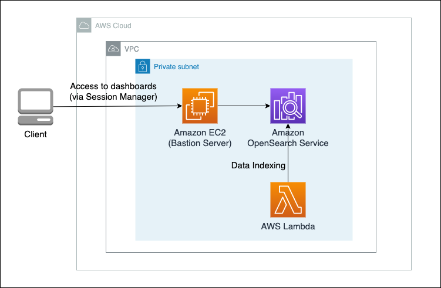

# Access OpenSearch Dashboard
The solution deployed the OpenSearch service database into a private subnet. End users access the OpenSearch Dashboards via port forwarding in AWS Session Manager, eliminating the need to expose the SSH port to the internet.



Run the following command to access OpenSearch Dashboards, after replacing **BastionHostId** and **OpenSearchDomainEndpoint** to the values output by cdk, **DeployedRegion** with the region where the solution is deployed.
```sh
aws ssm start-session --target <BastionHostId> --document-name AWS-StartPortForwardingSessionToRemoteHost --parameters '{"portNumber":["443"],"localPortNumber":["8157"], "host":["<OpenSearchDomainEndpoint>"]}' --region <DeployedRegion>
```
After starting session, access https://localhost:8157/_dashboards in your browser. Warning may appear because the domain (*.[region].es.amazonaws.com) in the certificate is different from the domain (localhost) you access. Since this does not cause serious problems, continue accessing the site, and you will see OpenSearch Dashboards.

Refer to this instruction on how to install Amazon Session Manager on your local machine: [instruction](https://docs.aws.amazon.com/systems-manager/latest/userguide/session-manager-working-with-install-plugin.html)