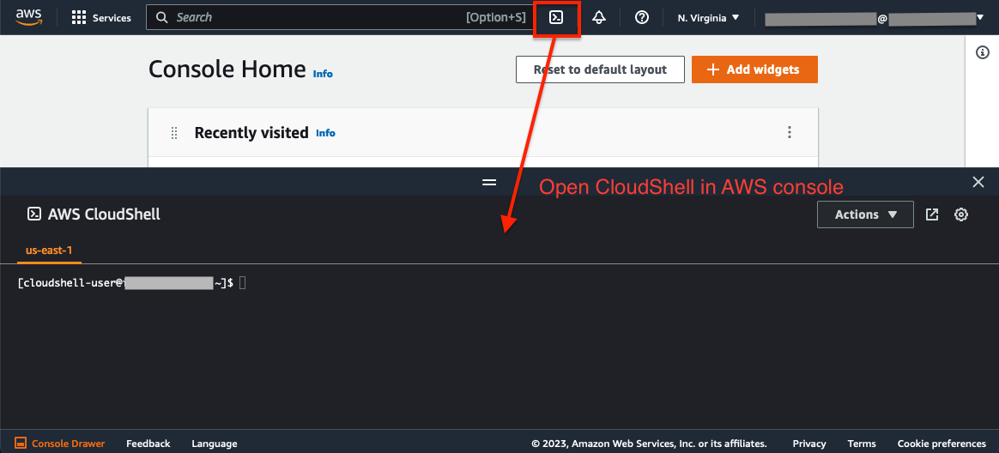
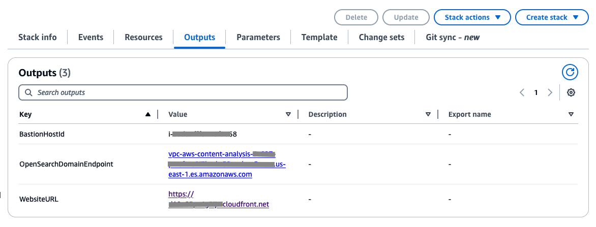

# Deployment Instruction
Follow these instructions to deploy all components, including the web portal with its user interface, to your AWS account.

## Supported AWS regions
The solution requires AWS AI services, including Amazon Bedrock, Amazon Rekognition and Amazon Transcribe, which are available in certain regions. Please choose one of the below AWS regions to deploy the CDK package.

|||||
---------- | ---------- | ---------- | ---------- |
US | us-east-1 (N. Virginia) | ||

## Prerequisites

- If you don't have the AWS account administrator access, ensure your [IAM](https://aws.amazon.com/iam/) role/user has permissions to create and manage the necessary resources and components for this solution.
- In Amazon Bedrock, make sure you have access to the required models. Refer to [this instruction](https://catalog.workshops.aws/building-with-amazon-bedrock/en-US/prerequisites/bedrock-setup) for detail.

## Install environment dependencies and set up authentication

<details><summary>
:bulb: Skip if using CloudShell or AWS services that support bash commands from the same account (e.g., Cloud9). Required for self-managed environments like local desktops.
</summary>

- [ ] Install Node.js
https://nodejs.org/en/download/

- [ ] Install Python 3.8+
https://www.python.org/downloads/

- [ ] Install Git
https://github.com/git-guides/install-git

- [ ] Install Pip
```sh
python -m ensurepip --upgrade
```

- [ ] Install Python Virtual Environment
```sh
pip install virtualenv
```


- [ ] Setup the AWS CLI authentication
```sh
aws configure                                                                     
 ```                      
</details>



If your CloudShell instance has older dependency libraries like npm or pip, it may cause deployment errors. To resolve this, click 'Actions' and choose 'Delete AWS CloudShell Home Directory' to start a fresh instance.

### Deploy the CDK package using CloudShell
1. Clone the source code from GitHub repo 

(Please download the zip file, upload it to CloudShell, and unzip the folder for testing purposes if the repo is not published on GitHub yet.)
```
git clone https://github.com/aws-samples/media-analysis-policy-evaluation-framework
cd media-analysis-policy-evaluation-framework
```

2. Set up environment varaibles 

Set environment variables as input parameters for the CDK deployment package:

CDK_INPUT_USER_EMAILS: Email address(es) for login to the web portal. They will receive temporary passwords.
```
export CDK_INPUT_USER_EMAILS=EMAILS_SPLIT_BY_COMMA
```
Update the values with your target AWS account ID and the region where you intend to deploy the demo application.
```
export CDK_DEFAULT_ACCOUNT=YOUR_ACCOUNT_ID
export CDK_DEFAULT_REGION=YOUR_TARGET_REGION (e.x, us-east-1)
```
(Optional) CDK_INPUT_OPENSEARCH_CONFIG: Configure the size of the Amazon OpenSearch cluster, accepting either "Dev" or "Prod" as values with a default value set to "Dev".
- Dev: suitable for development or testing environment. (No master node, 1 data node: m4.large.search)
- Prod: suitable for handling large volumes of video data. (3 master nodes: m4.large.search, 2 data nodes: m5.xlarge.search)
```
export CDK_INPUT_OPENSEARCH_CONFIG=OPENSEARCH_CONFIG ("Dev" or "Prod", default value: "Dev")
```


3. Run **deploy-cloudshell.sh** in CloudShell to deploy the application to your AWS account with the parameters defined in step 2.
```sh
bash deploy-cloudshell.sh
```

### Access the Web Portal
Once the deployment completes, you can find the website URL in the bash console. You can also find it in the CloudFormation console by checking the output in stack **AwsContentAnalysisRootStack**.

An email with a username and temporary password will be sent to the email(s) you provided in step 2. Users can use this information to log in to the web portal.



### Access OpenSearch Dashboard
The solution deployed the OpenSearch service database into a private subnet. End users access the OpenSearch Dashboards via port forwarding in AWS Session Manager, eliminating the need to expose the SSH port to the internet.


Run the following command to access OpenSearch Dashboards, after replacing <BastionHostId> and <OpenSearchDomainEndpoint> to the values output by cdk.
```sh
aws ssm start-session --target <BastionHostId> --document-name AWS-StartPortForwardingSessionToRemoteHost --parameters '{"portNumber":["443"],"localPortNumber":["8157"], "host":["<OpenSearchDomainEndpoint>"]}'
```
After starting session, access https://localhost:8157/_dashboards in your browser. Warning may appear because the domain (*.[region].es.amazonaws.com) in the certificate is different from the domain (localhost) you access. Since this does not cause serious problems, continue accessing the site, and you will see OpenSearch Dashboards.

Refer to this instruction on how to install Amazon Session Manager on your local machine: [instruction](https://docs.aws.amazon.com/systems-manager/latest/userguide/session-manager-working-with-install-plugin.html)